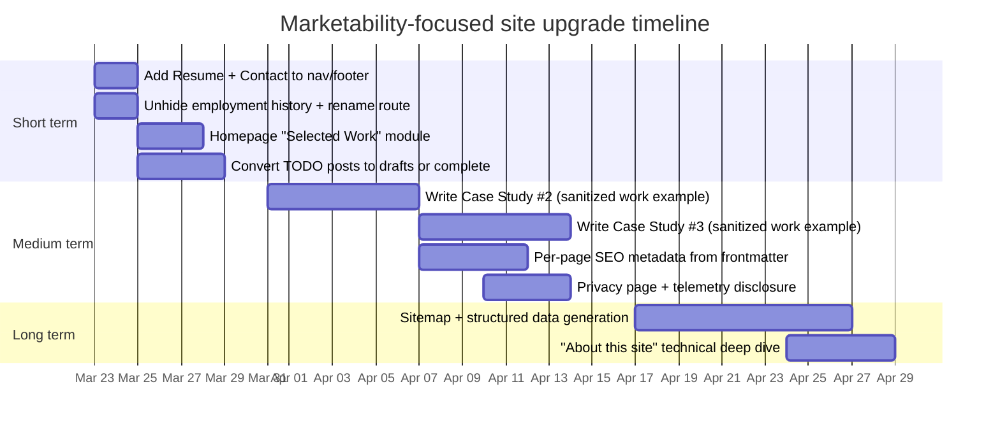

# nicholsslayton.com: Developer Marketability Review and Positioning Report

## Executive summary

nicholsslayton.com presents entity["people","Slayton Nichols","software engineer"] as a pragmatic, systems-minded engineer who values debugging discipline, clear mental models, and reliability-oriented delivery. The homepage is strongest when it communicates transferable engineering behaviors—problem decomposition, translating business needs into technical specs, and “visibility-first” engineering (logs/metrics/health checks). citeturn1view0turn18view0

The site’s single highest-market-signal asset is the long-form post “ML on Market Microstructure: What I Learned,” which demonstrates end-to-end ownership across data engineering scale, modeling, backtesting, and live execution. It also includes unusually concrete proof points (time invested, codebase scale, dataset scales, and live-trading stats), which is exactly the type of evidence hiring teams and clients look for when evaluating seniority and real-world competence. citeturn2view1turn25view3

The biggest constraints on marketability are not technical quality but “packaging.” The site currently lacks a clear portfolio/case-study layer, a direct contact conversion path, and a visible work-history entry point—despite having a hidden employment-history page that is content-rich and should be treated as a primary navigation destination. citeturn33view0turn1view2turn26view0 In addition, several publicly listed posts are marked “TODO” or read like placeholders; that creates an impression of incompleteness that can dilute the credibility created by the strongest post. citeturn28view0turn27view0turn2view3

From a product/UX and technical standpoint, the implementation is modern and generally sound: a statically generated entity["organization","Vue","javascript framework"] site built with Vite SSG, then served via an entity["company","Docker","container platform company"] → nginx container. Deployment is automated through entity["company","GitHub","code hosting platform"] workflows and pushed to a entity["company","DigitalOcean","cloud provider"] droplet behind an nginx-proxy + Let’s Encrypt companion setup. citeturn12view4turn12view0turn23view0turn23view1turn11view0 However, the site loads a real user monitoring (RUM) script from entity["company","Datadog","monitoring company"] with session replay enabled; this creates an immediate need for clear privacy disclosure and (depending on location/visitor base) consent mechanics. citeturn21view0

## Site crawl and inventory

### Crawl scope and what was accessible

This review crawled and analyzed:

- Homepage (`/`) citeturn1view0turn18view0  
- Blog index (`/posts`) and all posts shown as published there citeturn1view1turn24view0  
- Hidden “employment-history” post (`/posts/employment-history`) which is accessible by URL but excluded from the blog listing via frontmatter (`hidden: true`). citeturn1view2turn26view0turn24view0  
- The public site’s implementation details via its public source repository (used to extract metadata/frontmatter, navigation structure, build/deploy indicators, and third-party scripts). citeturn11view0turn15view1turn12view0turn21view0  

Items that could not be conclusively verified via the browsing environment:

- `robots.txt`, `sitemap.xml`, or feed endpoints (not discoverable via search results, and direct opening was restricted). As a result, sitemap/robots/feed status is treated as “unknown/unverified.”  

### Page-by-page inventory (content, metadata, structure)

| Page (relative path) | Visibility | Primary purpose | Visible headings / structure (high level) | Metadata (from frontmatter where applicable) | Notable assets & links |
|---|---|---|---|---|---|
| `/` | In header nav via logo; not explicitly labeled “Home” | Positioning statement + philosophy | “Who am I?”, “What is this Website?”, “What I Do”, plus skill pillars (debugging, business translation, reliability, iteration) citeturn1view0turn18view0 | `title: Slayton Nichols`, `date: 2026-03-17` citeturn18view0 | Mentions using “every tool available — especially A‑I” (site text), and emphasizes transferable fundamentals citeturn1view0turn18view0 |
| `/posts` | In top nav (“Blog”) citeturn33view0 | Content hub with tags and pinned posts | Tag filter UI; “Pinned”; list of posts with title/date/summary/tags citeturn1view1turn24view0 | Blog listing filters out `draft: true` and `hidden: true` posts citeturn24view0 | Tag-based navigation is built into the UI and driven by post frontmatter citeturn24view0turn15view2 |
| `/posts/todos` | Public + pinned on `/posts` citeturn1view1turn27view0 | “Now / roadmap” style page | “Currently Working On” with a short single bullet citeturn2view0turn27view0 | `title: TODOs`, `summary: In progress and future projects`, `date: 2022-10-20`, `pinned: true`, `draft: false` citeturn27view0 | Contains a line about using “A‑I to generate income” (site text) citeturn27view0 |
| `/posts/trading-bot-journey` | Public (listed) citeturn1view1turn25view3 | Deep technical narrative + proof of execution | “The Thesis”, “The Datasets”, “The Pipeline”, “Feature Engineering”, “Modeling”, “Backtesting”, “Live Trading”, “Final Thoughts” (and more) citeturn2view1turn25view3 | `title: ML on Market Microstructure: What I Learned`, `summary: …from scratch — data engineering, model architecture, live execution`, `date: 2026-03-17`, `draft: false` citeturn25view3 | Mentions BTC/USDT perpetual futures on entity["company","Bybit","crypto exchange"]; cites scale: ~33k lines of entity["company","Python","programming language company"], “billion rows,” multiple deployments citeturn25view3turn2view1 |
| `/posts/heart-rate-dlt` | Public (listed) citeturn1view1turn27view1 | ETL architecture example | “Bronze / Silver / Gold” with Databricks SQL example and explanation citeturn27view1turn2view2 | `title: Heart Rate Delta Live Tables Pipeline`, `summary: multi-hop ETL…`, `date: 2022-10-20`, `draft: false` citeturn27view1 | Demonstrates layered table design and streaming ingestion patterns citeturn27view1 |
| `/posts/databricks-setup` | Public (listed) citeturn1view1turn28view0 | Setup notes / learning resource | Marked “TODO: Details” with links to entity["company","Microsoft","software company"] documentation citeturn28view0turn2view3 | `title: Databricks Workspace Setup`, `date: 2022-10-19`, `draft: false` citeturn28view0 | Outbound links to entity["company","Microsoft","software company"] Learn articles citeturn28view0 |
| `/posts/employment-history` | Accessible by URL, not listed (“hidden”) citeturn1view2turn26view0 | Resume/work-history content | Role sections with accomplishment bullets across multiple jobs citeturn1view2turn26view0 | `title: Employment History`, `summary: Roles, experience, and delivery history`, `date: 2022-09-25`, `hidden: true`, `draft: false` citeturn26view0 | Shows breadth: data platform work, integrations, cloud services, CMS work citeturn1view2turn26view0 |

Non-public/draft content discovered in the repository:

- `/posts/oura-ring-hr-ingest` exists in source but is marked `draft: true`, and is therefore intentionally excluded from the blog index UI. citeturn25view0turn24view0 The post is also “TODO: Details” and links to a repo named `OuraRingDataIngest`. citeturn25view0

image_group{"layout":"carousel","aspect_ratio":"16:9","query":["nicholsslayton.com homepage","nicholsslayton.com blog posts page","nicholsslayton.com employment history page"],"num_per_query":1}

## Content and positioning analysis

### Themes, tone, and demonstrated strengths

The site’s tone is direct, engineering-forward, and grounded in real delivery concerns: ambiguous production issues, tracing dataflow through systems, defensive development, and incremental refactoring while keeping systems running. citeturn1view0turn26view0 This is a credible “senior engineer” voice because it emphasizes operating in uncertainty and moving from symptoms → hypotheses → validation → durable fixes. citeturn1view0turn26view0

The writing also shows a consistent preference for:

- Systems thinking and investigatory rigor (mental models, dataflow tracing). citeturn1view0turn26view0  
- Reliability as a first-class feature (logs/metrics/health checks and “assume upstream data is wrong”). citeturn1view0turn26view0  
- Cross-functional translation (turn vague requirements into testable specs). citeturn1view0turn26view0  

Those pillars map cleanly onto highly marketable roles: senior backend engineer, data platform engineer, platform/infra-adjacent product engineer, or “full-stack with data platform depth.” The site supports that positioning most effectively when it pairs philosophy with evidence (see next section). citeturn1view0turn25view3

### Where the site already provides strong proof

The market microstructure post is a de facto case study: it states a goal (“pass a $200K prop firm challenge and earn a funded account”), describes a differentiated modeling thesis (forecast microstructure response patterns at L2 depth rather than naive direction prediction), explains how execution constraints shaped design (“maker-only execution”), and details data pipelines, feature engineering, model iteration, backtesting realism, and live trading integration. citeturn2view1turn25view3

It also includes proof-of-work metrics that function like portfolio KPIs:

- Time invested (“past 8 months”), codebase scale (“~33,000 lines of Python”), model volume (“dozens of ML models”), and data scale (“a billion rows of orderbook data”). citeturn25view3  
- Multiple system components: ingestion, dataset building, modeling, backtesting, and live execution loops. citeturn2view1  

This is the kind of artifact that can anchor a portfolio—if the homepage and structure route readers toward it and summarize it in hiring-friendly language. Right now, it’s “discoverable” via `/posts`, but not leveraged as a primary conversion asset elsewhere. citeturn1view1turn1view0

Separately, the employment-history page is strong in “scope of responsibility” language: owning production issues end-to-end, leading multi-sprint migrations, building observability, and contributing to a DSL/rules engine. citeturn26view0 That is valuable evidence—but because it is hidden from the blog index and absent from the top nav, it is easy for visitors to miss. citeturn26view0turn24view0turn33view0

### Gaps and missed opportunities for marketability

The core gap is the absence of a portfolio “translation layer” between raw blog content / work bullets and what most hiring screens reward: clear problem statements, scoped ownership, technical decisions, and measurable outcomes. The site currently has pieces of this, but they are distributed and not packaged into a skim-friendly case study format. citeturn1view0turn25view3turn26view0

Specific gaps:

- **No dedicated portfolio or “selected work” section** on the homepage. The homepage is almost entirely narrative/behavioral; it does not quickly prove “here are the 3–5 things I built, why they mattered, and what changed as a result.” citeturn1view0turn18view0  
- **No direct contact CTA** (email, contact form, scheduling link, or “work with me / hiring” page). The only outbound conversion options are entity["company","LinkedIn","professional network company"] and entity["company","GitHub","code hosting platform"] links in the top nav. citeturn33view0  
- **Public “TODO” posts** (notably “Databricks Workspace Setup” and “TODOs”) weaken the otherwise strong signal from the highest-quality writing because a visitor cannot easily distinguish “published work” from “notes to self.” citeturn28view0turn27view0turn1view1  
- **Hidden employment history** reduces credibility during fast screens. The content exists and is good; the information architecture hides it. citeturn26view0turn33view0  

A concise way to view this is “skills claimed vs. skills proven”:

| Marketable competency | Current proof on the site | What’s missing to maximize credibility |
|---|---|---|
| End-to-end systems ownership | Explicitly described on homepage; reinforced in employment bullets citeturn1view0turn26view0 | 2–3 structured case studies with “problem → constraints → approach → results” summaries on the homepage |
| Data platform / pipelines | Delta Live Tables example + microstructure pipeline narrative citeturn27view1turn2view1 | A portfolio page with architecture diagrams and quantified outcomes (latency, cost, data volumes, incident reduction) |
| Reliability & observability | Strong language in homepage + employment bullets citeturn1view0turn26view0 | Concrete incident writeups (“before/after”), monitoring dashboards, SLO/SLA framing (even sanitized) |
| Product / cross-functional translation | Described explicitly (requirements → specs) citeturn1view0turn26view0 | Examples: PRDs turned into specs, tradeoffs, stakeholder outcomes, customer impact |
| Modern web engineering | Site implementation is modern (Vue + static gen + container deploy) citeturn12view4turn12view0turn33view0 | A dedicated “About this site” technical page: build pipeline, DX decisions, perf budget, accessibility checklist |

## UX, accessibility, and SEO assessment

### Layout, navigation, and information architecture

The top navigation is intentionally minimal: logo → home, plus “Blog,” “LinkedIn,” and “GitHub.” citeturn33view0 Minimalism can be effective, but here it creates a discoverability problem because the most hiring-relevant artifact—employment history—is not in the primary nav. citeturn26view0turn33view0

The “footer” is effectively empty (a `<footer>` container with no content). citeturn33view1 This is a missed UX and SEO opportunity: the footer is the standard place to put contact, resume link, privacy, and key internal navigation.

Blog UX is stronger than homepage IA: the tag filtering experience is built into the blog index and is driven by post metadata, with explicit filtering of drafts/hidden posts. citeturn24view0turn1view1 This is a genuinely useful browsing affordance and should be leveraged more prominently (e.g., “Start here” collections).

### Accessibility cues and likely issues (evidence-based)

Positive indicators:

- The header logo includes alt text (“SlaytonNichols logo”). citeturn33view0  
- The site sets `<meta name="viewport" …>` for mobile scaling. citeturn15view0  

Likely weaknesses (based on observed structure and source):

- **Heading hierarchy on the homepage**: the homepage content uses `###` headings and appears to lack a single page-level H1 (in the markdown source, the first visible headings are “### Who am I?” etc.). citeturn18view0turn1view0 This can hurt both screen-reader navigation and crawl clarity if not corrected at render time.  
- **Icon links**: the nav uses icons alongside visible text labels (Blog/LinkedIn/GitHub). That’s good, but focus states, keyboard navigation, and ARIA labeling cannot be confirmed without runtime testing. citeturn33view0  

### SEO basics and discoverability

What’s present:

- A global document title and meta description are set in the app shell (`title: 'SlaytonNichols'`, `meta description: 'Slayton Nichols - Software Engineer'`). citeturn17view2  
- The site is statically generated via Vite SSG (`vite-ssg build`), which generally helps crawlability compared to purely client-rendered SPAs. citeturn15view1turn12view4turn17view1  

What’s missing or unclear:

- **Per-page titles and descriptions** are not evidenced in the reviewed code excerpts. The global title/description are likely applied site-wide unless overridden per route. citeturn17view2turn16view1 This can limit the SEO value of distinct posts (especially the strongest long-form post).  
- **Sitemap and robots** cannot be verified as present. (They were not discoverable through the accessible browsing flow.)  
- **Structured data (JSON-LD)** is not evidenced in the reviewed source. (No schema markup was observed in the extracted app shell and config excerpts.) citeturn15view0turn17view2turn16view1  

“Lighthouse-like” assessment note: this environment could not run a live Lighthouse/PageSpeed audit against the domain. Therefore this section reports evidence-based “likely impacts” and provides instrumentation steps you can run to generate numeric scores locally/CI. citeturn12view4turn12view0turn21view0

## Technical implementation and operational signals

### Stack indicators and build system

The public repository describes the project as a “static markdown-driven personal site and blog,” built locally via npm, compiled into static output, and shipped as a container. citeturn11view0turn12view4turn15view1

Evidence-based implementation details:

- Static generation: `vite-ssg build` is used for production builds. citeturn15view1turn17view1  
- Content model: markdown posts live in `src/pages/posts/` and are parsed for frontmatter; the router meta is enriched with `frontmatter` and breadcrumb-like “crumbs.” citeturn12view4turn16view1turn18view1  
- Blog publishing controls: the blog index logic excludes `draft: true` and `hidden: true` posts, and supports `pinned: true`. citeturn24view0turn26view0turn25view0  
- UI stack: dependencies indicate Vue 3 + Vue Router, plus `@vueuse/head` for manipulating document head. citeturn15view1turn17view2  

### Hosting, deployment, and routing

The container build is a multi-stage Dockerfile: Node (build) → nginx (serve), copying the built `dist/` into nginx’s HTML directory. citeturn12view0

Routing behavior is tuned for static multi-page output:

- nginx is configured with `try_files $uri $uri.html $uri/index.html =404;` which supports clean URLs and static fallbacks. citeturn12view2  

Deployment evidence:

- The repo README states the release workflow builds the site, packages into an nginx image, pushes to GHCR, and deploys to a DigitalOcean droplet over SSH. citeturn11view0  
- A deployment template uses GHCR images and environment variables compatible with an nginx-proxy + Let’s Encrypt companion setup. citeturn23view0turn23view1  

### Security and privacy posture (notable finding)

A entity["company","Datadog","monitoring company"] RUM script is dynamically injected on the client, enabling interaction tracking and session replay sampling, with `defaultPrivacyLevel: 'mask-user-input'`. citeturn21view0 The module system auto-installs modules under `modules/`, and the app boot explicitly installs them at runtime. citeturn17view1turn20view0

Implication: even for a mostly static personal site, the presence of RUM + session replay makes a visible privacy disclosure (and potentially a consent banner, depending on jurisdiction/target audience) a professional trust signal. The public site currently does not evidence a privacy policy link in its UI (the footer component is empty). citeturn33view1turn21view0

## Recommendations, KPIs, and prioritized action plan

### Current vs recommended structure

The core structural goal: make it effortless for a visitor to answer, within 30–60 seconds, *“What does this developer build, what proof exists, and how do I start a conversation?”* The raw ingredients exist (especially the market microstructure post and employment history); the site needs a portfolio/CTA wrapper. citeturn25view3turn26view0turn33view0

| Area | Current state | Recommended state (marketability-oriented) |
|---|---|---|
| Primary navigation | Blog, LinkedIn, GitHub only citeturn33view0 | Add: Work (Case Studies), Resume, Contact. Keep Blog/GitHub/LinkedIn as secondary. |
| Homepage | Strong philosophy/approach; little “proof above the fold” citeturn1view0turn18view0 | Add a “Selected work” strip with 3 projects + measured outcomes (even sanitized). |
| Employment history | High-quality but hidden from blog index and nav citeturn26view0turn33view0 | Make it first-class: rename to “Resume” or “Work History,” link in nav and footer; add a PDF export. |
| Blog quality consistency | One standout deep post; multiple TODO/placeholder posts publicly listed citeturn25view3turn28view0turn27view0 | Keep “notes” as drafts; publish only finished posts. Create a “Lab Notes” section if you want rough work publicly. |
| Footer | Empty citeturn33view1 | Add links: Contact, Resume PDF, Privacy, RSS/feed (if added), GitHub, LinkedIn, “Built with …” |
| Trust & compliance | RUM + session replay present; no visible disclosure citeturn21view0turn33view1 | Create Privacy page + brief cookie/telemetry note; add opt-out if appropriate. |

### Specific content edits and sample copy

The best strategy is to take what you already wrote (strong systems language + one flagship technical case study) and reframe it into scannable product-style artifacts: hero statement, 3–5 case studies, and a clear “how to contact me” funnel. citeturn1view0turn25view3turn33view0

#### Homepage: recommended hero and “selected work” module

Current “What I Do” is strong but long; it should be preceded by a 1–2 sentence positioning line plus proof. citeturn1view0turn18view0

Sample hero (suggested copy):

- **Headline:** “Senior Software Engineer building data platforms and reliable backend systems.” citeturn17view2turn26view0  
- **Subhead:** “I translate messy requirements into maintainable systems—pipelines, services, and internal tools—then instrument them so teams can trust what ships.” citeturn1view0turn26view0  
- **Primary CTA buttons:** “View case studies” and “Contact” (email/form). (CTA is currently missing; add it.) citeturn33view0turn33view1  

“Selected work” cards (sample framing using existing site content):

1) **Market microstructure trading system (case study)**  
   - *One-liner:* “Built an end-to-end research + execution stack: high-frequency orderbook datasets, model iteration, realistic backtesting, and live deployment.” citeturn2view1turn25view3  
   - *Proof points:* “~33k lines of Python,” “billion-row orderbook training sets,” “multiple live deployments.” citeturn25view3  
   - *Link:* the existing post (this is your flagship). citeturn1view1turn2view1  

2) **Delta Live Tables multi-hop ETL example**  
   - *One-liner:* “Designed a bronze/silver/gold pipeline demonstrating streaming ingestion and curated outputs.” citeturn27view1turn2view2  
   - *Proof points:* “Streaming live tables,” join-based enrichment, curated gold output. citeturn27view1  

3) **Employment history as delivery evidence**  
   - *One-liner:* “Owned production issues end-to-end and led multi-sprint migrations on a data platform team; built validation and observability practices.” citeturn26view0  
   - *Link:* `/posts/employment-history` (but rename path or alias to `/resume`). citeturn26view0  

#### Employment history: formatting and credibility upgrades

The bullets are already unusually strong because they focus on behaviors and scope. citeturn26view0turn1view2 To maximize marketability:

- Add a short “Impact summary” per role with **2–3 concrete outcomes** (latency reduction, incident reduction, migration completion, cost reduction, scale handled). Even rough ranges are better than none, as long as they’re truthful. citeturn26view0  
- Add a **tech stack line** per role (e.g., C#, .NET, Databricks, SQL, cloud services), because recruiters often scan for keyword matches first. The page already contains some stack references in role bullets (Azure Functions, MongoDB, AWS Lambda, CloudWatch, CMS), but it’s inconsistent and buried. citeturn26view0turn13search2  
- Move the page from hidden → visible, and link it in the primary nav and footer. It is currently hidden by frontmatter and excluded by blog index logic. citeturn26view0turn24view0turn33view0  

#### Blog strategy: publish fewer, higher-signal posts

Your blog already has the right “north star” for marketability: deep technical work tied to real constraints. citeturn25view3turn2view1

Recommendations:

- Convert “TODO” posts to **draft** status unless they are completed. “Databricks Workspace Setup” is publicly listed but still “TODO: Details.” citeturn28view0turn1view1  
- Split content into two explicit categories:
  - **Case Studies** (edited, outcome-oriented; portfolio-grade)
  - **Lab Notes** (short, exploratory, allowed to be rough)  
  This prevents rough notes from diluting credibility while preserving the “notepad” ethos you describe. citeturn1view0turn27view0turn28view0
- For each Case Study post, add a consistent “top box”:
  - Problem / context
  - Constraints
  - What you built
  - Results / metrics
  - Links (repo, diagrams, demos)

### UX/SEO/implementation improvements with high leverage

These changes create disproportionate payoff for hiring funnels:

- **Per-page titles and meta descriptions:** Use `@vueuse/head` to set title/description from frontmatter on each post route (you already parse frontmatter into route meta). This avoids every post sharing the same metadata. citeturn17view2turn16view1turn24view0  
- **Add a real footer:** contact, resume link, and privacy link; the current footer component is empty. citeturn33view1  
- **Add a Privacy page + telemetry disclosure:** because Datadog RUM is enabled with session replay sampling and interaction tracking. citeturn21view0turn33view1  
- **Heading structure:** ensure each page renders a single H1 and logical H2/H3 structure. The homepage markdown currently begins at H3-level headings (“### Who am I?”). citeturn18view0turn1view0  
- **Sitemap + robots:** generate a sitemap during build and serve it statically. (Not currently evidenced/verified.) citeturn15view1turn12view0  
- **Add structured data:** JSON-LD for `Person` on homepage and `BlogPosting` on posts. (Not currently evidenced in extracted app shell/config.) citeturn17view2turn16view1  

### Marketability KPIs to track

To treat the site like a product funnel, track:

- **Visitor → profile click-through rate:** clicks to LinkedIn/GitHub per unique visitor. (Those are current primary conversion paths.) citeturn33view0  
- **Visitor → contact conversion rate:** requires adding a contact CTA (email or form). citeturn33view1turn33view0  
- **Case study engagement:** average time on page and scroll depth for the flagship post and the top 2–3 case studies. citeturn2view1  
- **Search landing distribution:** how many land on `/posts/trading-bot-journey` vs `/` vs `/posts`. (Requires analytics; the site currently uses Datadog RUM but does not surface reporting publicly.) citeturn21view0turn24view0  
- **Recruiter screen KPI:** “Can a visitor find Resume + 2 proof projects in <60 seconds?” (Qualitative but extremely predictive.)

### Prioritized action plan with effort and impact

| Priority | Initiative | Estimated effort | Expected impact | Why it matters |
|---|---|---:|---:|---|
| Short term | Add “Resume/Work History” and “Contact” to nav + footer; unhide employment history | 1–3 hours | High | Removes the biggest discovery/conversion bottleneck citeturn26view0turn33view0turn33view1 |
| Short term | Add homepage “Selected work” cards linking to flagship post + ETL post + work history | 3–6 hours | High | Turns passive bio into proof-driven positioning citeturn25view3turn27view1turn1view0 |
| Short term | Convert public TODO posts to drafts (or complete them) | 1–2 hours (to draft) / 4–8 hours (to complete) | Medium–High | Avoids credibility loss from incomplete public pages citeturn28view0turn27view0turn25view0 |
| Medium term | Create 2 additional case studies (in the same format as the flagship) from employment-history bullets (sanitized) | 1–2 days | High | Case studies are the strongest hiring artifact outside of interviews citeturn26view0turn2view1 |
| Medium term | Implement per-page SEO metadata (title/description/OG) based on frontmatter | 4–8 hours | Medium–High | Improves search snippets + share previews; reduces “same title everywhere” risk citeturn17view2turn16view1turn24view0 |
| Medium term | Add Privacy page + telemetry disclosure; evaluate consent needs | 4–8 hours | Medium | Professional trust signal; aligns with RUM + session replay usage citeturn21view0turn33view1 |
| Long term | Add sitemap + structured data generation in build | 1–2 days | Medium | Compounding SEO benefit; easier indexing of posts citeturn15view1turn12view4turn16view1 |
| Long term | Publish a technical “About this site” page explaining build/deploy pipeline | 4–8 hours | Medium | Demonstrates engineering maturity and operational competence citeturn12view0turn23view0turn11view0 |

### Implementation timeline (Mermaid Gantt)

